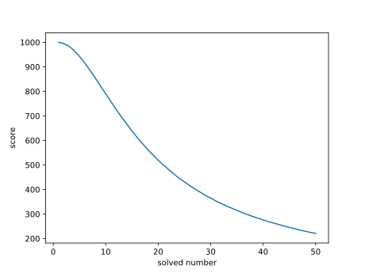

# Tp0t OJ

[](https://github.com/Tp0t-Team/Tp0tOJ/actions/workflows/oj-build.yaml)

延续老版本的Tp0t OJ，前端继承并优化了视觉效果，后端从JAVA切换为Golang，定位也从一个面向校内的持续性训练平台，转向于一个比CTFd更好用的CTF比赛平台

欢迎非盈利性质的比赛使用我们的平台，比如各大学校的校赛等，也欢迎大家提PR和ISSUE

**特别提醒盈利性质的赛事服务提供商（通过提供CTF比赛服务来获取酬金）如果使用本平台提供服务同样需要遵循AGPL开源**

### 我们的特性

| 特性  | Tp0t OJ | CTFd | dasctf |
| --- | --- | --- | --- |
| K8s集群 -> 一键部署题目环境 | :heavy_check_mark: | :x: | :heavy_check_mark: |
| 题目定义与实例分离 -> 原生支持动态Flag | :heavy_check_mark: | :x: | :heavy_check_mark: |
| 预构建单执行文件 -> 无其他依赖，平台一键启动 | :heavy_check_mark: | :x: | :x: |
| 提供WriteUp的上传和下载通道 | :heavy_check_mark: | :x: | :heavy_check_mark: |
| 动态积分+一二三血 | :heavy_check_mark: | :x: | :x: |
| 容器调度，避免算力浪费 | :heavy_check_mark: | :x: | :x: |
| 合理的动态积分曲线 | :heavy_check_mark: | :x: | :x: |

## 平台部署指南

### 环境准备

**官方推荐Ubuntu20.04 AMD64与 Ubuntu22.04 AMD64**，release中的版本支持linux/amd64，但是未在众多的linux发行版上完成测试，如果有完成其他发行版的测试，请提交issue让我们知道
其他系统和架构请按照[编译指南](https://github.com/Tp0t-Team/Tp0tOJ/blob/master/README.md#%E5%BC%80%E5%8F%91%E6%8C%87%E5%8D%97)自行编译，目前已经不需要依赖CGO

因为题目image build依赖于docker，所以需要先安装好**和本机网段无冲突的Docker**，我们在测试过程中发现部分云服务提供商默认Docker网段和本机局域网网段冲突，导致build镜像的时候无法正常访问网络

[Install Docker Engine | Docker Documentation](https://docs.docker.com/engine/install/)

如果需要调整网段，在`/etc/docker/daemon.json`中配置bip字段，参考如下，网段可更改

```json
{
    "bip": "192.168.100.1/24"
}
```

然后重启docker服务

```shell
sudo systemctl daemon-reload
sudo systemctl restart docker
```

请确保当前系统中有`systemd`环境 [什么是systemd](https://systemd.io/)

当前用户需要在 sudo 组

### 部署流程

根据系统架构在release页面获取 prepare 二进制文件，如果所用系统架构没有对应的release，请参照contribution自行build

```shell
./prepare -MasterIP xxx.xxx.xxx.xxx
INSTALL_K3S_MIRROR=cn ./prepare -MasterIP xxx.xxx.xxx.xxx #for CHINA
```

**中国用户请使用Mirror的参数执行**

执行`prepare` 会在当前目录下生成配置文件目录`resources`，安装完成后目录应该如下所示，其中`https.crt`、`https.key` 文件不会默认生成。平台启动时会自动检测这两个文件，如果存在，就自动启用https模式，否则采用http模式

`home.html`为提供了主页面定制化的功能，在前后端一体化的单文件模式下，如果平台`resources` 目录中存在`home.html` 会将其作为平台主页展示

```
.
├── agent-install.sh     #「在从节点服务器上使用」从节点安装文件
├── OJ                   #平台二进制文件
├── prepare              #部署器二进制文件
├── resources            #配置文件目录
│   ├── ca.crt           #镜像仓库自签名根证书备份
│   ├── config.yaml      #「平台启动前请修改」平台配置文件模板
│   ├── docker-registry  #镜像仓库相关目录
│   │   ├── auth         #镜像仓库授权文件目录
│   │   │   └── htpasswd #授权文件
│   │   ├── certs        #镜像仓库证书目录
│   │   │   ├── tls.crt  #镜像仓库证书
│   │   │   └── tls.key  #镜像仓库私钥
│   │   └── data         #镜像仓库数据存储目录
│   ├── [https.crt]      #「非自动生成」网站TLS证书
│   ├── [https.key]      #「非自动生成」网站TLS私钥
│   ├── k3s.yaml         #自动生成的k3s配置文件，不需要修改
|   ├── [home.html]      #「非自动生成」如果存在，会加载该网页做为主页面
│   ├── tls.crt          #镜像仓库公私钥备份
│   └── tls.key          #镜像仓库公私钥备份
└── start.sh             #「配置完毕后启动」启动脚本
```

然后使用 `start.sh`启动平台

`agent-install.sh`是自动生成的从节点安装文件，从节点为平台集成k8s的从节点，由随平台部署的主节点进行管理，**该脚本在需要部署的从节点服务器上运行！**

将该文件拷贝到从节点服务器上，执行

```shell
./agent-install.sh xxx.xxx.xxx.xxx #从节点服务器公网IP
```
如果需要卸载k3s，参考官网

To uninstall K3s from a server node, run:

```bash
/usr/local/bin/k3s-uninstall.sh
```

To uninstall K3s from an agent node, run:

```bash
/usr/local/bin/k3s-agent-uninstall.sh
```

#### 平台配置说明

```yaml
server:                              #平台服务器的配置参数
  host: 127.0.0.1                    #设置为外网IP，用于重置密码功能
  username: Tp0t                     #默认admin用户名
  password: admin                    #默认admin账号密码
  mail: admin@example.com            #默认admin账号邮箱
  port: 0                            #0时自动选择80/443，非0指定端口
  salt: "xxxxxxxxxx"                 #用于密码保护的salt，自动生成
  behaviorLog: false                 #用于记录选手关键行为，默认不开启
email:                               #邮件服务配置
  host: smtp.example.com             #邮件服务提供商服务器
  username: exampleUsername          #邮件发送账号
  password: examplePassword          #邮件发送账号密码（可能为授权码）
challenge:                           #题目分数控制参数
  firstBloodReward: 0.1              #一血分数奖励比例
  secondBloodReward: 0.08            #二血分数奖励比例
  thirdBloodReward: 0.05             #三血分数奖励比例
  halfLife: 20                       #题目分值减半所需解题人数
kubernetes:                          #k8s集群配置参数
  portAllocBegin: 30000              #自动分配端口范围起点
  portAllocEnd: 31000                #自动分配端口终点
  username: xxxxxxxx                 #「不可修改」镜像仓库用户名
  password: xxxxxxxx                 #「不可修改」镜像仓库密码
  registryHost: xxx.xxx.xxx.xxx:5000 #「不可修改」镜像仓库地址（与平台一致） 
```

邮件服务配置为必要配置，用户重置和修改密码依赖于邮件服务，**未配置邮件服务将导致用户无法修改密码**

题目分数曲线公式：

$$k=\frac{1.8414\cdot(N_{solved}-1)}{HalfLife}$$

$$RealScore=\left\lfloor\frac{BaseScore}{k+e^{-k}}\right\rfloor$$

<!-- }{HalfLife}) -->

<!--  -->

题目分数曲线示例：



基础分数1000，减半人数20，不含奖励分数情况下 动态积分曲线

## 平台使用指南

需要使用k8s集群的基本就是PWN题和WEB题

[Pwn_demo1](https://github.com/Tp0t-Team/Tp0tOJ_demos/tree/main/pwn1)

### 镜像编译

在镜像编译页面上传镜像，需要上传包含Dock而file的tar包，**注意tar包没有额外目录层级，需要直接能获取到Dockerfile**

对于PWN题，推荐使用`xinetd`作为守护进程

#### Dockerfile示例

> - **注意对于所有需要执行的文件，附加执行权限，否则镜像会build成功，但是用户申请创建实例的时候会失败**
>   
> - 对于singleton的题目（所有选手共用一个容器实例），请严格注意权限管控
>   

```dockerfile
FROM ubuntu:20.04
RUN sed -i "s/http:\/\/archive.ubuntu.com/http:\/\/mirrors.ustc.edu.cn/g" /etc/apt/sources.list
RUN apt-get update
RUN apt-get -y upgrade
RUN apt-get install -y apt-utils lib32z1 xinetd
RUN useradd -u 8888 -m pwn
COPY share/libunicorn.so.1 /usr/local/lib/libunicorn.so.1
RUN chmod 755 /usr/local/lib/libunicorn.so.1
RUN ldconfig
COPY share/easiestpwn /home/pwn/easiestpwn
RUN chmod 755 /home/pwn/easiestpwn
RUN rm /etc/xinetd.d/*
COPY xinetd /etc/xinetd.d/xinetd
COPY entrypoint.sh /home/pwn/entrypoint.sh
ENTRYPOINT ["/home/pwn/entrypoint.sh"]
EXPOSE 8888
```

#### `entrypoint.sh`示例

对于动态flag的题目，必须具备`entrypoint.sh`文件，因为平台会将生成的随机flag通过`entrypoint.sh`的第一个参数的形式传入

```shell
#!/bin/sh
echo $1 > flag #动态FLAG的必须行，用于平台将生成的FLAG写入，也可自行调整写入位置
/usr/sbin/xinetd -dontfork #启动守护进程
```

#### 守护进程`xinetd`示例

```
service pwn 
{
    disable = no
    type        = UNLISTED
    wait        = no
    server      = /bin/sh
    # replace helloworld to your program
    server_args = -c cd${IFS}/home/pwn;exec${IFS}./easiestpwn
    socket_type = stream
    protocol    = tcp
    user        = pwn 
    port        = 8888
    # bind        = 0.0.0.0
    # safety options
    flags       = REUSE
    per_source    = 10 # the maximum instances of this service per source IP address
    rlimit_cpu    = 1 # the maximum number of CPU seconds that the service may use
    #rlimit_as  = 1024M # the Address Space resource limit for the service
    #access_times = 2:00-9:00 12:00-24:00
    nice        = 18
}
```

#### 打包示例

打包可以使用gz、xz压缩，但是推荐使用tar直接打包，打包不能包含当前文件夹

举个例子，如果Dockerfile等文件都放在`/home/pwn/example`下，需要运行以下指令打包

```shell
cd /home/pwn/example
tar -cvf ../example.tar ./*
```

### 题目部署

yaml文件用于上一键导入题目信息以及配置题目所属的K8S节点，需要使用节点部署的题只能通过导入config的形式添加

```yaml
name: pwn1 #challenge页面显示的题目名称
category: PWN #题目类型
score:
  baseScore: 1000 #基本分数，动态积分和奖励根据基本分数的一定比例计算
  dynamic: true #是否开启动态积分
flag: 
  value: flag{test} #对于开启动态flag的题目value字段没用，flag由平台随机生成
  dynamic: true #是否开启动态flag
description: "this is a test pwn"
externalLink: [http://cloud.lordcasser.com/s/DkxtK] #题目附件链接
singleton: false #true时题目所有用户都是同一个环境/flag，false时每人一个环境
nodeConfig:
  - name: "pwn1" #节点名称，要求[a~z 0~9]且必须有一个字母
    image: "pwn1" #题目使用镜像的名称，需要提前上传好所使用的镜像
    servicePorts:
      - name: http #不用更改
        protocol: TCP #不用更改
        external: 8888 #指定docker对外暴露的端口
        internal: 8888 #指定docker容器内端口
        pod: 0 # 集群pod对外的端口，也是用户实际访问的端口，0为自动分配
```

##

## 开发指南

### 前端

- **请在`app`目录下打开vscode**
- **npm相关命令，请在`app`目录下运行**
- 总之请将`app`做为工作目录

### 后端

- **使用Goland将`server`作为工作目录**

### 接口相关

- GraphQL的schema文件定义在`server/src/resources/schema`目录下
  
- 请求成功返回message 为空字符串（没有消息就是好消息）
  

### 构建

前端环境准备：依赖latest版本的npm和nodejs，在app目录下执行

```shell
npm install #必要情况下可以删除package-lock.json
```

构建前后端一体化可执行文件：依赖golang，在server目录下执行

```shell
go run build.go
```

构建prepare可执行文件

```shell
go build prepare.go
```
